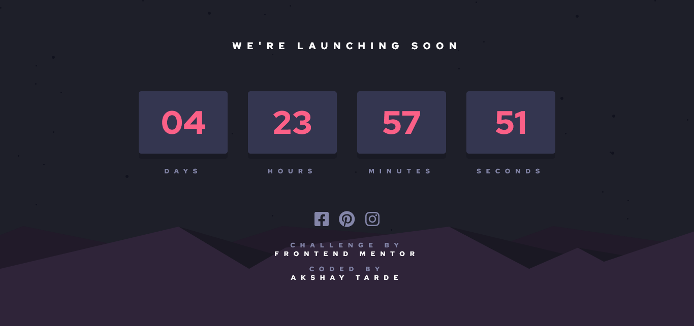

# Frontend Mentor - Launch countdown timer solution

This is a solution to the [Launch countdown timer challenge on Frontend Mentor](https://www.frontendmentor.io/challenges/launch-countdown-timer-N0XkGfyz-). Frontend Mentor challenges help you improve your coding skills by building realistic projects. 

## Table of contents

- [Overview](#overview)
  - [The challenge](#the-challenge)
  - [Screenshot](#screenshot)
  - [Links](#links)
- [My process](#my-process)
  - [Built with](#built-with)
  - [What I learned](#what-i-learned)
  - [Continued development](#continued-development)
- [Author](#author)

## Overview

### The challenge

Users should be able to:

- See hover states for all interactive elements on the page
- See a live countdown timer that ticks down every second (start the count at 14 days)
- **Bonus**: When a number changes, make the card flip from the middle

### Screenshot

Desktop Layout

### Links

- Solution URL: [Frontend Mentor](https://www.frontendmentor.io/solutions/launch-countdown-timer-responsive-kbGVDNYhs3)
- Live Site URL: [Try out the site](https://launch-countdown-timer-amt.netlify.app/)

## My process

This time, I made the desktop layout first. Then I added media queries for when my layout started to break.

### Built with

- Semantic HTML5 markup
- CSS custom properties
- Flexbox
- CSS Grid
- Desktop-first workflow
- JavaScript

### What I learned

Using JavaScript to write timer logic was really great.  
Updating the timer each second was a really great exercise.

### Continued development

Future work would be to implement the bonus part of this challenge, i.e., to add in the flip animation each time the counter changes.

## Author

- Frontend Mentor - [@Akshay-Tarde](https://www.frontendmentor.io/profile/Akshay-Tarde)
- Twitter - [@_4kshay_](https://twitter.com/_4kshay_)
